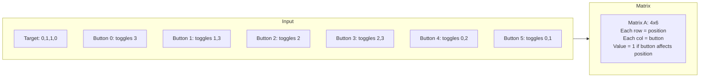
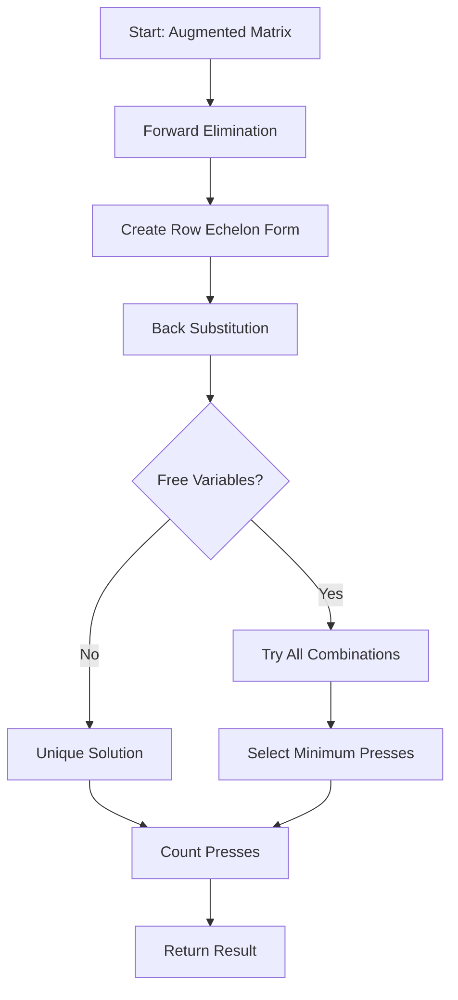
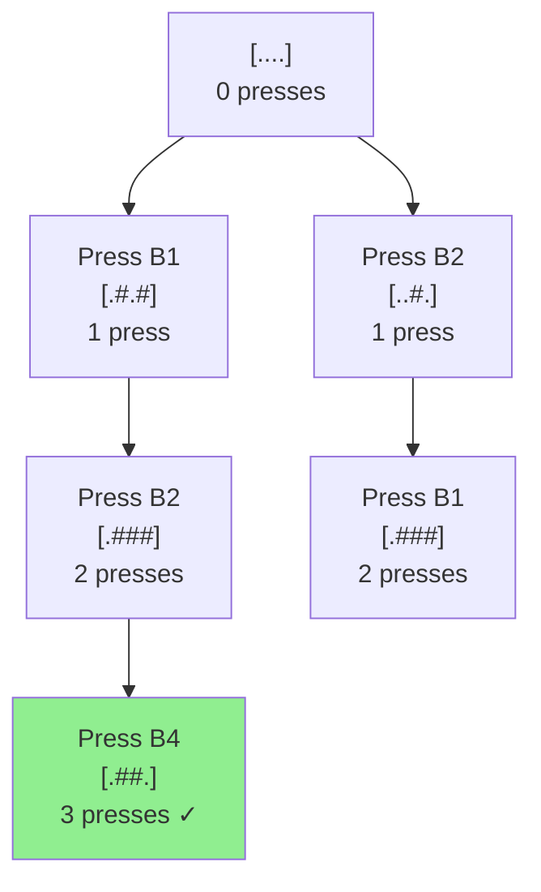
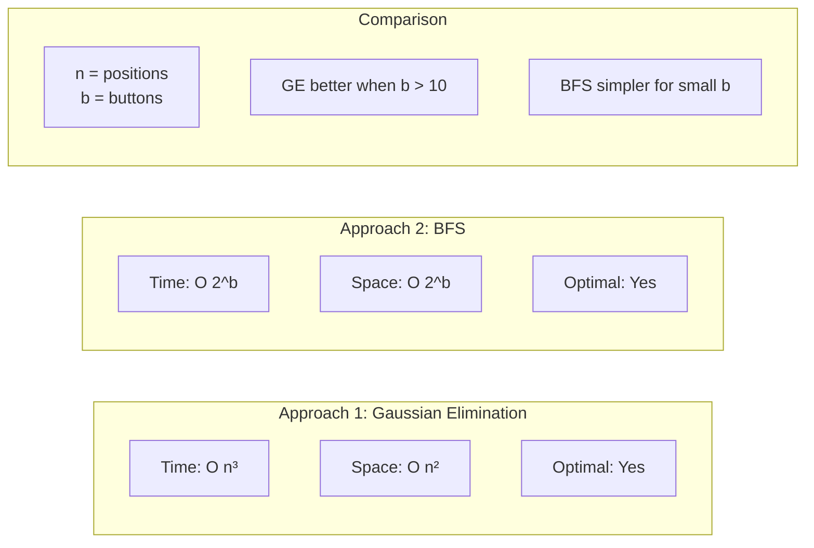
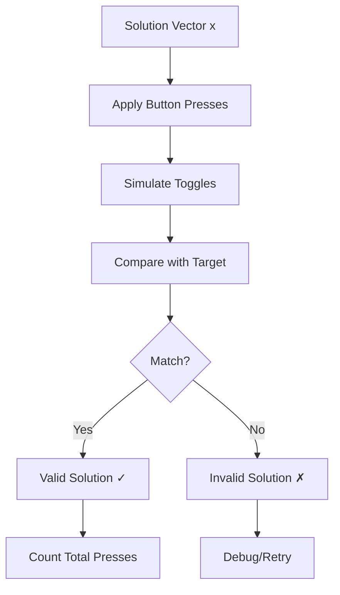

# Algorithm Visualization

## Problem Flow

```mermaid
graph TD
    A[Input: Target State and Buttons] --> B[Parse Input]
    B --> C[Build Matrix Representation]
    C --> D[Create Augmented Matrix A|b]
    D --> E[Gaussian Elimination over GF2]
    E --> F{Solution Exists?}
    F -->|Yes| G[Extract Solution Vector]
    F -->|No| H[Return: No Solution]
    G --> I[Count Button Presses]
    I --> J[Return Minimum Presses]
```

## Matrix Construction Example

For target `[.##.]` with 4 positions and 6 buttons:



## Gaussian Elimination Process



## State Space Example

Starting state: `[....]` (all dots)
Target state: `[.##.]`



## Algorithm Complexity Analysis



## Solution Verification Flow



## Data Structure Design

```mermaid
classDiagram
    class PuzzleInput {
        +list~char~ target_state
        +list~list~int~~ buttons
        +int num_positions
        +int num_buttons
    }
    
    class Matrix {
        +list~list~int~~ data
        +int rows
        +int cols
        +swap_rows()
        +add_rows()
        +get_pivot()
    }
    
    class Solver {
        +PuzzleInput puzzle
        +Matrix matrix
        +build_matrix()
        +gaussian_elimination()
        +extract_solution()
        +count_presses()
    }
    
    class Solution {
        +list~int~ buttons_to_press
        +int total_presses
        +bool is_valid
        +verify()
    }
    
    PuzzleInput --> Solver
    Solver --> Matrix
    Solver --> Solution