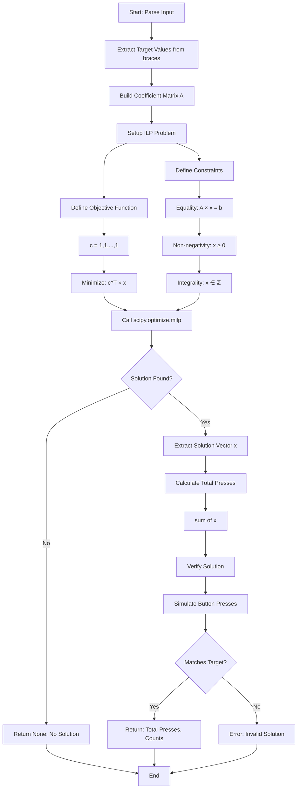
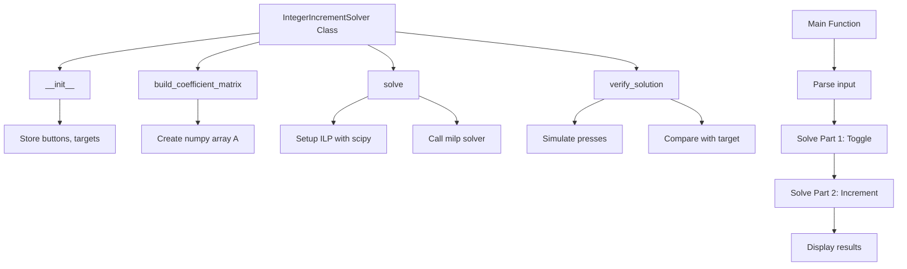

# Part 2: Integer Increment Puzzle - Algorithm Diagrams

## Problem Visualization

### Part 1 vs Part 2 Comparison

```
Part 1 (Toggle - Binary Field GF(2))
=====================================
Start:  [0, 0, 0, 0]  (all dots)
Target: [0, 1, 1, 0]  (pattern with hashes)
Action: Toggle (XOR)
Presses: 0 or 1 per button
Goal: Minimum buttons pressed

Part 2 (Increment - Integer Field ℤ)
====================================
Start:  [0, 0, 0, 0]  (all zeros)
Target: [3, 5, 4, 7]  (integer values)
Action: Increment (+1)
Presses: 0, 1, 2, ... per button
Goal: Minimum total presses
```

## Algorithm Flow



## Matrix Construction

### Example: First Sample Puzzle

```
Input: [.##.] (3) (1,3) (2) (2,3) (0,2) (0,1) {3,5,4,7}
```

### Step 1: Identify Components

```
Positions: 4 (indices 0-3)
Buttons: 6 (indices 0-5)
Target: [3, 5, 4, 7]

Button Effects:
- Button 0: affects position 3
- Button 1: affects positions 1, 3
- Button 2: affects position 2
- Button 3: affects positions 2, 3
- Button 4: affects positions 0, 2
- Button 5: affects positions 0, 1
```

### Step 2: Build Matrix A (4×6)

```
        B0  B1  B2  B3  B4  B5
    ┌─────────────────────────┐
P0  │  0   0   0   0   1   1  │
P1  │  0   1   0   0   0   1  │
P2  │  0   0   1   1   1   0  │
P3  │  1   1   0   1   0   0  │
    └─────────────────────────┘
```

### Step 3: System of Equations

```
Position 0: 0×x₀ + 0×x₁ + 0×x₂ + 0×x₃ + 1×x₄ + 1×x₅ = 3
Position 1: 0×x₀ + 1×x₁ + 0×x₂ + 0×x₃ + 0×x₄ + 1×x₅ = 5
Position 2: 0×x₀ + 0×x₁ + 1×x₂ + 1×x₃ + 1×x₄ + 0×x₅ = 4
Position 3: 1×x₀ + 1×x₁ + 0×x₂ + 1×x₃ + 0×x₄ + 0×x₅ = 7

Simplified:
x₄ + x₅ = 3          (eq1)
x₁ + x₅ = 5          (eq2)
x₂ + x₃ + x₄ = 4     (eq3)
x₀ + x₁ + x₃ = 7     (eq4)

Minimize: x₀ + x₁ + x₂ + x₃ + x₄ + x₅
```

## Solution Process

### Linear Programming Formulation

```
Minimize:
    f(x) = x₀ + x₁ + x₂ + x₃ + x₄ + x₅

Subject to:
    x₄ + x₅ = 3
    x₁ + x₅ = 5
    x₂ + x₃ + x₄ = 4
    x₀ + x₁ + x₃ = 7
    x₀, x₁, x₂, x₃, x₄, x₅ ≥ 0
    x₀, x₁, x₂, x₃, x₄, x₅ ∈ ℤ
```

### Example Solution Path

```
From eq1: x₄ + x₅ = 3
From eq2: x₁ + x₅ = 5

If x₅ = 2:
    x₄ = 3 - 2 = 1
    x₁ = 5 - 2 = 3

From eq3: x₂ + x₃ + 1 = 4
    x₂ + x₃ = 3

From eq4: x₀ + 3 + x₃ = 7
    x₀ + x₃ = 4

If x₃ = 2:
    x₂ = 3 - 2 = 1
    x₀ = 4 - 2 = 2

Solution: [2, 3, 1, 2, 1, 2]
Total presses: 2+3+1+2+1+2 = 11
```

## Verification Process

```mermaid
graph LR
    A[Solution: x = 2,3,1,2,1,2] --> B[Initialize state = 0,0,0,0]
    B --> C[Button 0: 2 presses]
    C --> D[Increment pos 3 by 2]
    D --> E[State: 0,0,0,2]
    E --> F[Button 1: 3 presses]
    F --> G[Increment pos 1,3 by 3]
    G --> H[State: 0,3,0,5]
    H --> I[Button 2: 1 press]
    I --> J[Increment pos 2 by 1]
    J --> K[State: 0,3,1,5]
    K --> L[Button 3: 2 presses]
    L --> M[Increment pos 2,3 by 2]
    M --> N[State: 0,3,3,7]
    N --> O[Button 4: 1 press]
    O --> P[Increment pos 0,2 by 1]
    P --> Q[State: 1,3,4,7]
    Q --> R[Button 5: 2 presses]
    R --> S[Increment pos 0,1 by 2]
    S --> T[State: 3,5,4,7]
    T --> U{Matches Target?}
    U -->|Yes| V[PASS ✓]
    U -->|No| W[FAIL ✗]
```



## Complexity Analysis

### Time Complexity

```
Matrix Construction: O(n × m)
    where n = positions, m = buttons

ILP Solving: O(2^m) worst case
    but polynomial in practice for most instances

Verification: O(m × avg_positions_per_button)

Overall: Dominated by ILP solver
```

### Space Complexity

```
Matrix A: O(n × m)
Solution vector: O(m)
Target vector: O(n)

Total: O(n × m)
```

## Comparison with Part 1

```
┌─────────────────┬──────────────────┬──────────────────┐
│    Aspect       │     Part 1       │     Part 2       │
├─────────────────┼──────────────────┼──────────────────┤
│ Field           │ GF(2) (binary)   │ ℤ (integers)     │
│ Operations      │ XOR              │ Addition         │
│ Button range    │ {0, 1}           │ {0, 1, 2, ...}   │
│ Algorithm       │ Gaussian Elim    │ ILP              │
│ Complexity      │ O(n³)            │ Polynomial/NP    │
│ Solution space  │ Finite (2^m)     │ Potentially ∞    │
│ Optimization    │ Count 1s         │ Sum all values   │
└─────────────────┴──────────────────┴──────────────────┘
```

## Implementation Strategy



## Key Insights

1. **Integer vs Binary**: Part 2 requires integer solutions, not just binary
2. **Optimization**: Minimize total presses, not just count of buttons used
3. **Constraints**: Must satisfy exact equality (not just parity)
4. **Solver**: Need ILP solver, not just Gaussian elimination
5. **Verification**: Critical to ensure solution is correct

## Expected Results Format

```
Puzzle 1: [.##.] → {3,5,4,7}
━━━━━━━━━━━━━━━━━━━━━━━━━━━━━━━━━━━━━━━━━━━━━━━━━━━━━━━━━━━━━━━━━━

Part 1 (Toggle to Pattern):
  ✓ Solution found!
  Minimum presses: 2
  Buttons pressed: [1, 3]

Part 2 (Increment to Values):
  ✓ Solution found!
  Target values: [3, 5, 4, 7]
  Minimum total presses: 11
  Button press counts:
    - Button 0: 2 presses
    - Button 1: 3 presses
    - Button 2: 1 press
    - Button 3: 2 presses
    - Button 4: 1 press
    - Button 5: 2 presses
  Verification: PASS ✓