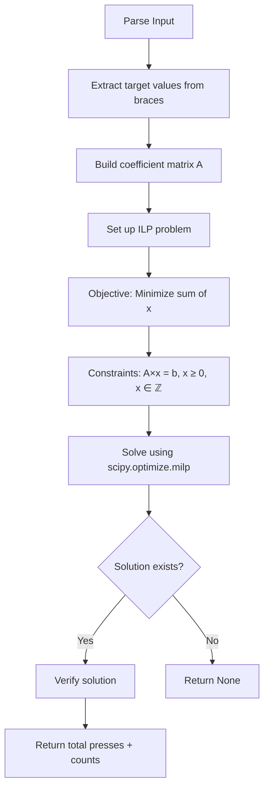

# Part 2: Integer Increment Puzzle - Solution Plan

## Problem Statement

**Part 2 Changes from Part 1:**
- **Starting state**: All positions are 0 (not all dots)
- **Target state**: Integer values in `{...}` (e.g., `{3,5,4,7}`)
- **Button behavior**: Each button press increments ALL positions it affects by 1 (not toggle)
- **Goal**: Find minimum total button presses to reach target values

## Mathematical Formulation

This is a **system of linear equations over integers** (ℤ), not GF(2):

```
A × x = b
```

Where:
- `A` = button effect matrix (n × m) - same structure as Part 1
- `x` = number of times each button is pressed (non-negative integers)
- `b` = target values from `{...}`
- `n` = number of positions
- `m` = number of buttons

**Objective**: Minimize `sum(x)` (total button presses)

**Constraints**: 
- `A × x = b`
- `x ≥ 0` (can't press buttons negative times)

## Key Differences from Part 1

| Aspect | Part 1 (Toggle) | Part 2 (Increment) |
|--------|----------------|-------------------|
| Field | GF(2) (binary) | Integers (ℤ) |
| Operations | XOR (toggle) | Addition |
| Button presses | 0 or 1 times | 0, 1, 2, ... times |
| Solution space | Binary vector | Non-negative integer vector |
| Optimization | Count 1s in solution | Sum all button presses |
| Complexity | O(n³) | Polynomial (LP) or NP-hard (ILP) |

## Example Walkthrough

### Sample Input
```
[.##.] (3) (1,3) (2) (2,3) (0,2) (0,1) {3,5,4,7}
```

### Target Values
`{3,5,4,7}` means:
- Position 0 → 3
- Position 1 → 5
- Position 2 → 4
- Position 3 → 7

### Button Effects
- Button 0: increments position 3
- Button 1: increments positions 1, 3
- Button 2: increments position 2
- Button 3: increments positions 2, 3
- Button 4: increments positions 0, 2
- Button 5: increments positions 0, 1

### Matrix Representation

```
Position | B0 | B1 | B2 | B3 | B4 | B5 | Target
---------|----|----|----|----|----|----|-------
    0    | 0  | 0  | 0  | 0  | 1  | 1  |   3
    1    | 0  | 1  | 0  | 0  | 0  | 1  |   5
    2    | 0  | 0  | 1  | 1  | 1  | 0  |   4
    3    | 1  | 1  | 0  | 1  | 0  | 0  |   7
```

### System of Equations

Find non-negative integers x₀, x₁, x₂, x₃, x₄, x₅ such that:
- `x₄ + x₅ = 3` (position 0)
- `x₁ + x₅ = 5` (position 1)
- `x₂ + x₃ + x₄ = 4` (position 2)
- `x₀ + x₁ + x₃ = 7` (position 3)

**Minimize**: `x₀ + x₁ + x₂ + x₃ + x₄ + x₅`

## Solution Approaches

### Approach 1: Linear Programming (Recommended) ✓

Use **Integer Linear Programming (ILP)** to solve:

**Minimize**: `c^T × x` where `c = [1, 1, ..., 1]`

**Subject to**: 
- `A × x = b`
- `x ≥ 0`
- `x ∈ ℤ` (integer constraint)

**Implementation Options**:
1. **scipy.optimize.linprog** - For continuous LP (may need rounding)
2. **scipy.optimize.milp** - For mixed-integer LP (exact)
3. **pulp** - High-level ILP library
4. **cvxpy** - Convex optimization

**Advantages**:
- Guaranteed optimal solution
- Handles constraints naturally
- Well-tested libraries available
- Efficient for most practical cases

**Complexity**: 
- LP relaxation: Polynomial time
- ILP: NP-hard in worst case, but efficient in practice

### Approach 2: Gaussian Elimination + Parametric Solution

1. Use Gaussian elimination to find general solution
2. Express solution in terms of free variables
3. Find non-negative integer values that minimize objective

**Advantages**:
- No external dependencies
- Similar to Part 1 approach
- Educational value

**Challenges**:
- Need to handle integer constraints manually
- May have infinite solutions
- Optimization step is non-trivial

### Approach 3: Greedy Heuristic (Not Recommended)

Not suitable - won't guarantee optimal solution for this problem.

## Recommended Implementation

### Strategy: Linear Programming with scipy

```python
from scipy.optimize import linprog, milp, LinearConstraint, Bounds
import numpy as np

class IntegerIncrementSolver:
    """Solve the integer increment puzzle using Linear Programming."""
    
    def __init__(self, button_lists: list[list[int]], target_values: list[int]):
        self.buttons = button_lists
        self.targets = target_values
        self.num_positions = len(target_values)
        self.num_buttons = len(button_lists)
    
    def build_coefficient_matrix(self) -> np.ndarray:
        """Build the coefficient matrix A."""
        A = np.zeros((self.num_positions, self.num_buttons), dtype=int)
        for button_idx, positions in enumerate(self.buttons):
            for pos in positions:
                if 0 <= pos < self.num_positions:
                    A[pos, button_idx] = 1
        return A
    
    def solve(self) -> Optional[tuple[int, list[int]]]:
        """
        Solve using Integer Linear Programming.
        Returns (total_presses, button_press_counts) or None.
        """
        A = self.build_coefficient_matrix()
        b = np.array(self.targets)
        c = np.ones(self.num_buttons)  # Minimize sum of all variables
        
        # Set up constraints: A × x = b, x ≥ 0
        constraints = LinearConstraint(A, lb=b, ub=b)
        bounds = Bounds(lb=0, ub=np.inf)
        
        # Solve as MILP (Mixed Integer Linear Program)
        result = milp(
            c=c,
            constraints=constraints,
            bounds=bounds,
            integrality=np.ones(self.num_buttons)  # All variables are integers
        )
        
        if result.success:
            solution = result.x.astype(int)
            total_presses = int(np.sum(solution))
            return total_presses, solution.tolist()
        else:
            return None
    
    def verify_solution(self, solution: list[int]) -> bool:
        """Verify that button presses produce target values."""
        state = [0] * self.num_positions
        
        for button_idx, press_count in enumerate(solution):
            for pos in self.buttons[button_idx]:
                if 0 <= pos < self.num_positions:
                    state[pos] += press_count
        
        return state == self.targets
```

## Algorithm Flow



## Integration with Existing Code

### 1. Update Parsing
Already done - [`parse_line()`](main.py:286-315) extracts `final_numbers` from `{...}`

### 2. Add Part 2 Solver
Create new `IntegerIncrementSolver` class alongside `ButtonPuzzleSolver`

### 3. Update Main Loop
```python
def main():
    # ... existing code ...
    
    for i, line in enumerate(lines, 1):
        chars, button_lists, final_numbers = parse_line(line)
        
        # Part 1: Toggle puzzle
        result_part1 = solve_puzzle(chars, button_lists)
        print_part1_results(result_part1)
        
        # Part 2: Increment puzzle (if target values provided)
        if final_numbers:
            result_part2 = solve_increment_puzzle(button_lists, final_numbers)
            print_part2_results(result_part2)
```

## Testing Strategy

### Test Cases
Use the sample data:
1. `{3,5,4,7}` - First puzzle
2. `{7,5,12,7,2}` - Second puzzle
3. `{10,11,11,5,10,5}` - Third puzzle

### Verification
For each solution:
1. Check that `A × x = b`
2. Check that all `x[i] ≥ 0`
3. Verify by simulation (increment positions)
4. Compare total presses with expected if available

## Expected Output Format

```
Part 1 (Toggle):
  Minimum presses: 3
  Buttons pressed: [1, 2, 4]

Part 2 (Increment):
  Target values: [3, 5, 4, 7]
  Minimum presses: 15
  Button press counts: [2, 3, 1, 2, 1, 2]
  Verification: PASS ✓
```

## Edge Cases

1. **No solution exists**: System is inconsistent
2. **Unique solution**: Rank(A) = number of buttons
3. **Multiple solutions**: Rank(A) < number of buttons (LP finds optimal)
4. **Zero target**: All positions should remain 0 (solution: press nothing)
5. **Large values**: May need many button presses

## Dependencies

```python
# Required
import numpy as np
from scipy.optimize import milp, LinearConstraint, Bounds

# Optional (for alternative approaches)
# import pulp
# import cvxpy
```

## Complexity Analysis

- **Time**: O(n³ × m) for ILP in practice (worst case exponential)
- **Space**: O(n × m) for matrix storage
- **Optimal**: Yes, guaranteed to find minimum if solution exists

## Next Steps

1. Implement `IntegerIncrementSolver` class
2. Add `solve_increment_puzzle()` function
3. Update `main()` to handle both parts
4. Test with sample data
5. Document results
6. Switch to Code mode for implementation